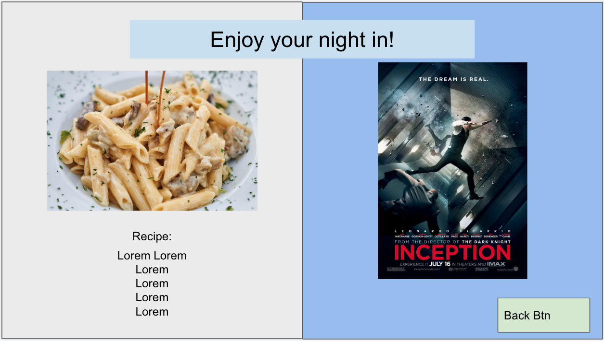

# A Night In
- Project title - A Night In
- Project description - We want to create an application that would allow the user to choose options for recipes to cook at home and select a movie for a night in. 
- User Story
As a user
I want to find options for food & entertainment for a night in
So I can have more options of what to do and eat. 
- Wireframe or sketch of the design (see below)
- APIS to be used - Edamam https://www.edamam.com/ & IMDB-API https://imdb-api.com/api
- Rough breakdown of tasks 
Goals for Wed 11/9:
- research both of the apis
- decide materialize or tailwind // leaning toward materialize 
- pseudo code on Wednesday 
- research code examples for review on what our task breakdowns should be 

Wireframe Screenshots

