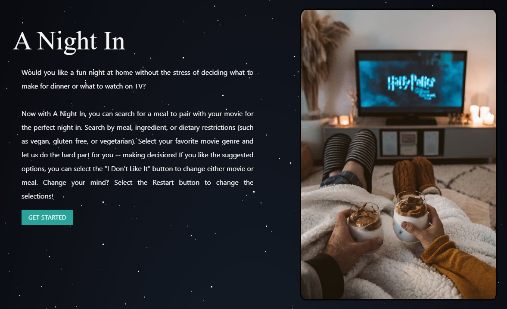
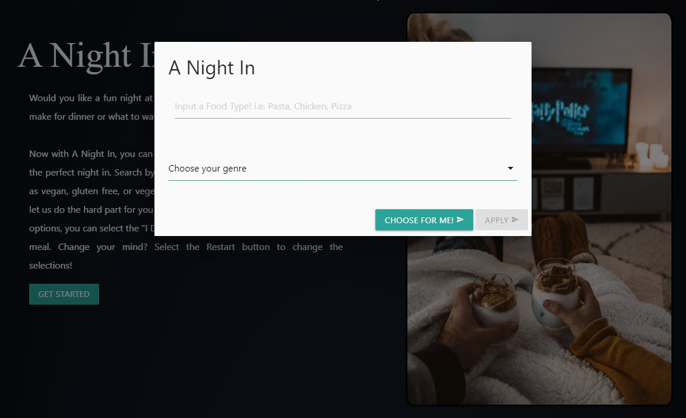
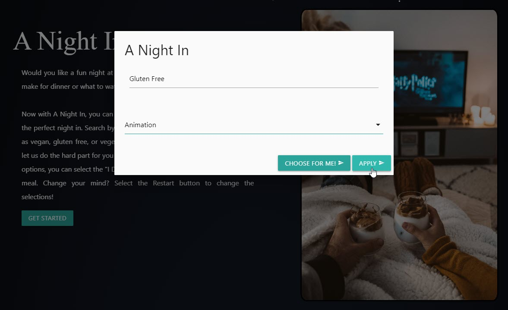
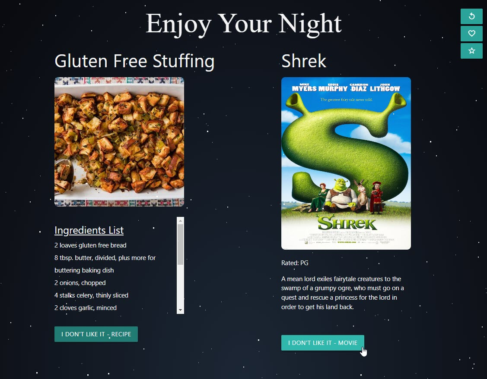
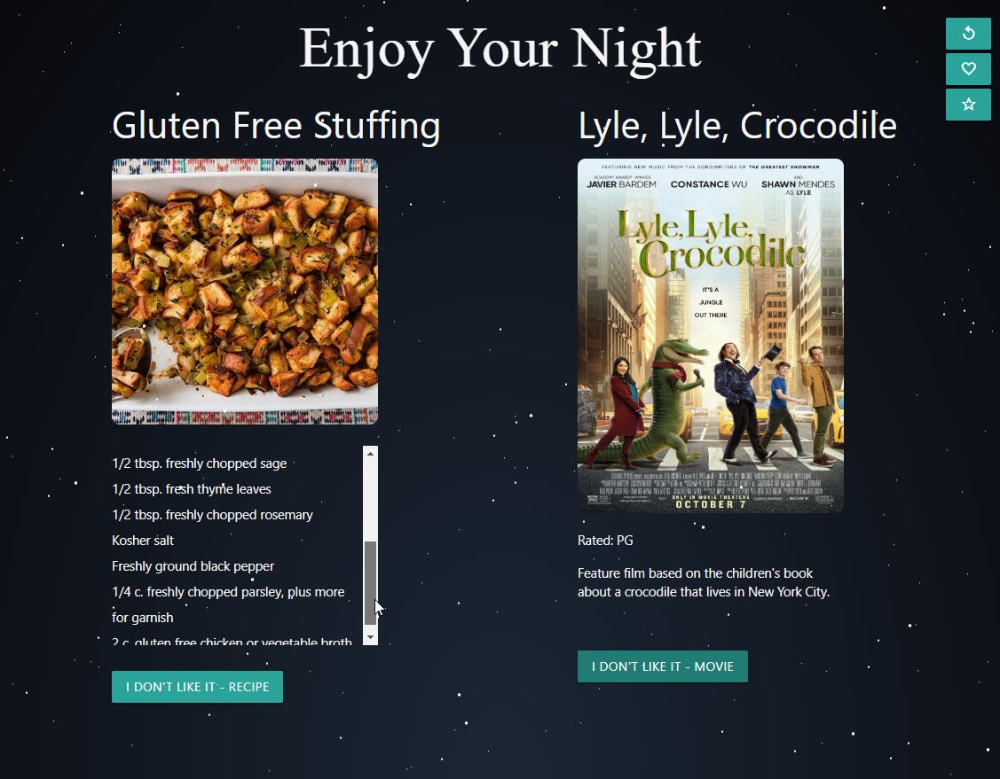
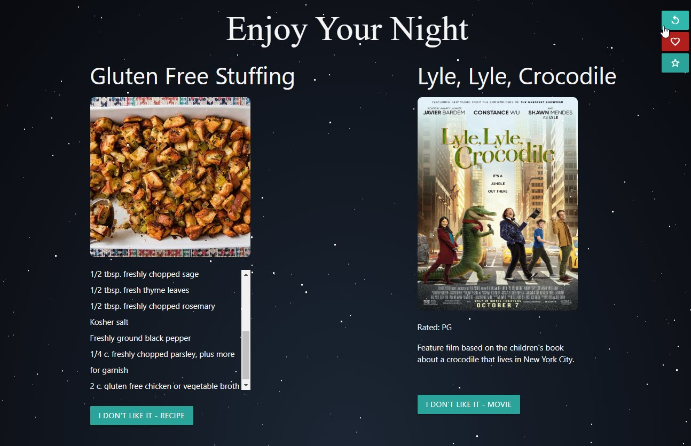
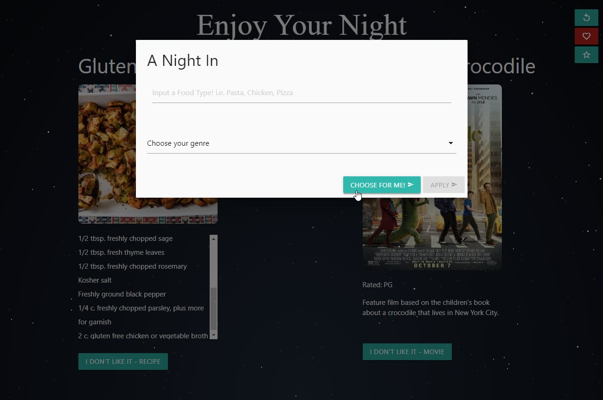
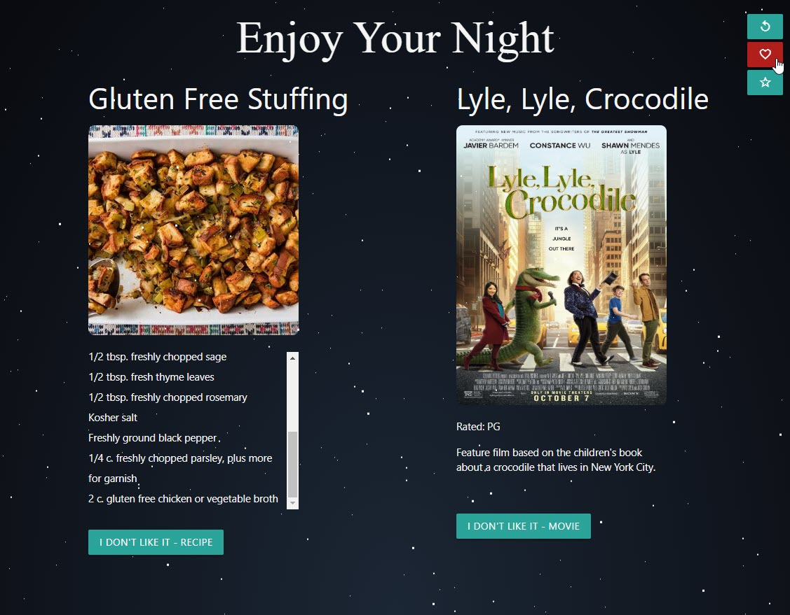
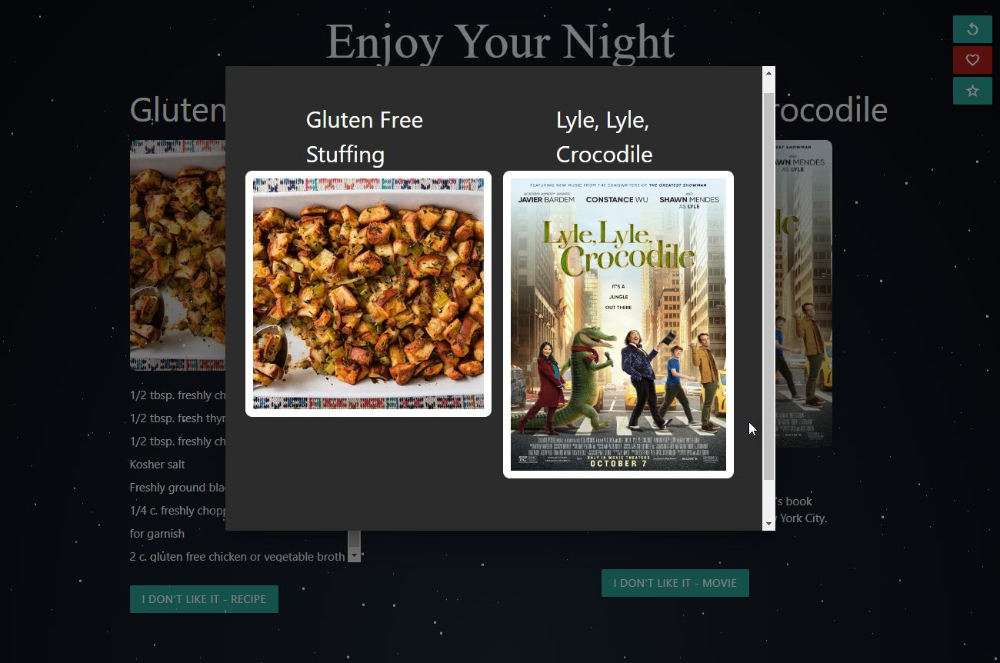

# A Night In

## User Story:

    AS A host
    I WANT to be provided with options for a meal and a movie in one location
    So THAT I can host a fun night in without the stress of decision-making.
    
## Description

For our group project we wanted to provide an application that would assist in choosing movie and dinner for a fun night at home. We found the shared problem in our personal lives of determining what to cook for dinner and what to watch when spending time at home with a loved one, family gathering, or group of friends. We wanted to provide an interactive application for users to provide a meal keyword and movie genre. The user can select their own inputs or they can let the application chose for them.  The user can then save their favorite options to use again. We hope that this application streamlines the decision making process for users to have a stress-free night in.

---
## Usage

1. Read through the introduction page and click GET STARTED button. 

2. Type in a meal keyword. This can be dietary (ex. vegan), ingredient (ex. chicken), regional (ex. Italian), or meal (ex. pasta).
3. Select a movie genre from the drop down list.

4. Click APPLY button. OR click CHOOSE FOR ME! button for application to choose meal keyword and movie genre. 

5. Review suggestions provided by application. 
6. If you **like one** of the options but **dislike** the other: (ex. like meal but dislike movie) then click the I DON'T LIKE IT button for the option you wish to change. 

7. If you **like both** options: you are all set. Click the meal photo to open the full recipe in a new tab.
8. If you **dislike both** options: click the RESTART ICON button to bring up the selection modal again.

9. If you would like to **save** your options: click the RED HEART ICON button to save to your favorites. Click the VIEW FAVORITES button to view all saved options. Click the CLEAR FAVORITES button to clear all favorites.

---
## Credits - Group 9

- Cody Dawkins: https://github.com/dawki5
- Alberto Suarez: https://github.com/albertosuarez8
- Jean Santiago: https://github.com/JM-Santi
- Maggie Messer: https://github.com/magmesser

## Technologies Used

Languages:
- HTML
- CSS
- JavaScript

Third-Party APIs:
- jQuery
- Materialize CSS
- Google Fonts
- Google Font Icons
- Normalize CSS

Server-Side APIs:
- Edamam: https://www.edamam.com/ - API for meal generator  
- IMDB-API: https://imdb-api.com/api - API for movie generator 

## Future Development

- We would like to link the movie poster result to a streaming service, so the user can click to start watching from the application results screen.
- We would like to add the option to view favorites to the home page, so the user can view favorited combinations on page load. 
- We would like to improve the UX/UI design.

## Links
Click the link below to access the deployed site on GitHub Pages.
https://magmesser.github.io/a-night-in/ 

Click the link below to access to application repository on GitHub.
https://github.com/magmesser/a-night-in 

Project presentation: https://docs.google.com/presentation/d/10hfp8zhbi2x7eocy5wdwnV0y1bPAPMVHseBMo1RN6Y0/edit#slide=id.g320332ed93_1_0 